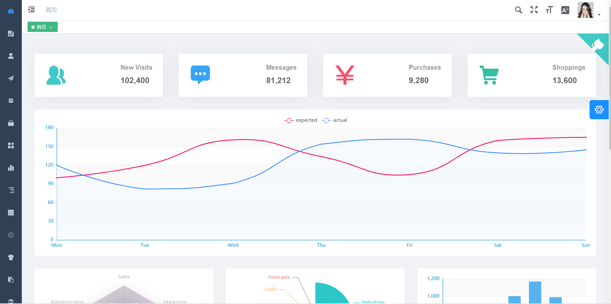

## laravel + vueJs 后台管理系统


### 安装注意事项

> ### nodeJs 版本问题： v10 > 最新
> ### node-sass 安装不上使用 `Chinese mirror`

    npm config set sharp_binary_host "https://npm.taobao.org/mirrors/sharp"
    npm config set sharp_libvips_binary_host "https://npm.taobao.org/mirrors/sharp-libvips"
    npm install sharp


> ### 最好的办法是先在命令行下执行上面的命令再执行 npm install , 不进入 docker 环境

安装： 

```bash
git clone https://github.com/whitexiong/laravue.git
cd laravue

# Migration and DB seeder (after changing your DB settings in .env)
php artisan migrate --seed

# Install dependency with NPM
npm install

# develop
npm run dev # or npm run watch

# Build on production
npm run production
```

#### Docker
```sh
docker-compose up -d
```
Build static files within Laravel container with npm
```sh
# Get laravel docker container ID from containers list
docker ps

docker exec -it <container ID> npm run dev # or npm run watch
# Where <container ID> is the "laravel" container name, ex: src_laravel_1
```
Open http://localhost:8000 (laravel container port declared in `docker-compose.yml`) to access Laravue

